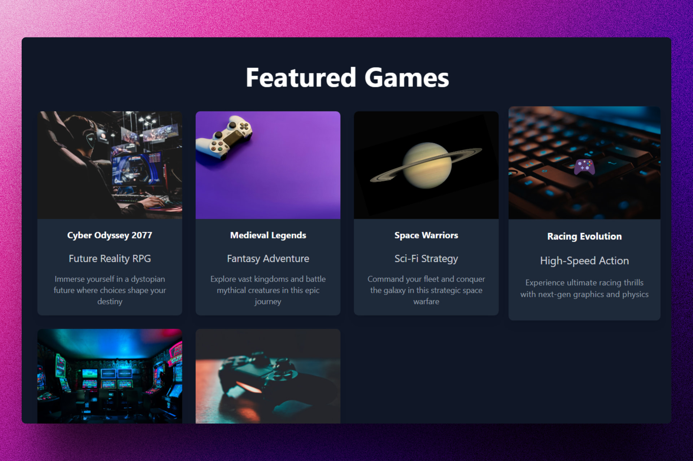

<div align='center'>

# ✨ Tailwind CSS: Mejores practicas

</div>

### Repositorio con buenas prácticas al momento de usar Tailwind CSS.

> 🧩 Aquí puedes ver su [**Live Demo**](https://tailwind-best-practices-abrahamgalue.pages.dev/).



## 🚀 Descripción

Este repositorio proporciona una configuración mínima para que Preact funcione en Vite con TypeScript y Tailwind CSS. 

El objetivo principal es mostrar cómo desarrollar una aplicación que muestre videojuegos utilizando estas tecnologías, siguiendo las mejores prácticas de Tailwind CSS para un código limpio, reutilizable y mantenible.

## ⚡ Comenzar

### Prerrequisitos

1. Git.
2. Node.js: cualquier versión a partir de la 18 o superior.

## 🔧 Instalación

### Usando npm

1. **Clona el repositorio:**

   ```bash
   git clone https://github.com/abrahamgalue/tailwind-best-practices.git
   cd tailwind-best-practices
   ```

2. **Instala las dependencias:**

   ```bash
   npm install
   ```

### Ejecución local (modo desarrollo)

1. **Inicia el servidor de desarrollo:**

   ```bash
   npm run dev
   ```

   Esto iniciará el servidor de desarrollo de Vite y tu aplicación estará disponible en `http://localhost:5173`.

### Ejecución local (modo producción)

1. **Compila la aplicación para producción:**

   ```bash
   npm run build
   ```

   Esto generará una versión optimizada de tu aplicación en la carpeta `dist`.

2. **Inicia el servidor de producción:**

   ```bash
   npm run preview
   ```

   Esto iniciará un servidor local para que puedas probar la versión de producción de tu aplicación. La aplicación estará disponible en `http://localhost:4173`.

---

## Mejores prácticas

Este proyecto implementa **Tailwind CSS** siguiendo las mejores prácticas para mantener un diseño consistente, reutilizable y fácil de mantener. A continuación, algunos principios clave aplicados en esta configuración:

### **1. Clases reutilizables con `@apply` (usadas moderadamente)**

Centralizamos estilos comunes, como botones y tarjetas, en un archivo CSS base para evitar duplicación.

```css
.btn-primary {
  @apply bg-blue-500 text-white font-bold py-2 px-4 rounded hover:bg-blue-600;
}
.card {
  @apply bg-gray-800 rounded-lg shadow-md p-4;
}
```

### **2. Orden lógico de clases**

Seguimos un orden coherente en las clases para facilitar la lectura:  
**layout > display > spacing > border > color > text**.

```tsx
<div className="flex items-center justify-between px-4 py-2 bg-gray-800 text-white rounded-lg shadow">
```

Como recomendación personal te recomiendo usar **Prettier** como lo detalla [documentación oficial de Tailwind CSS](https://tailwindcss.com/docs/editor-setup#class-sorting-with-prettier) al respecto.

### **3. Uso del tema personalizado**

Configuramos colores y tamaños personalizados en nuestro archivo CSS para mantener un diseño consistente.

```css
@theme {
  --font-display: "Satoshi", "sans-serif";

  --breakpoint-3xl: 120rem;

  --color-avocado-100: oklch(0.99 0 0);
  --color-avocado-200: oklch(0.98 0.04 113.22);
  --color-avocado-300: oklch(0.94 0.11 115.03);
  --color-avocado-400: oklch(0.92 0.19 114.08);
  --color-avocado-500: oklch(0.84 0.18 117.33);
  --color-avocado-600: oklch(0.53 0.12 118.34);

  --ease-fluid: cubic-bezier(0.3, 0, 0, 1);
  --ease-snappy: cubic-bezier(0.2, 0, 0, 1);

  /* ... */
}
```

Esto asegura que los colores y estilos sean reutilizables y fáciles de ajustar.

### **4. Variantes para estilos dinámicos**

Usamos variantes como `hover:`, `focus:`, `sm:` para controlar estilos según el estado o el tamaño de pantalla.

```tsx
<button className="bg-blue-500 hover:bg-blue-600 focus:ring-2 focus:ring-blue-300">
  Click Me
</button>
```

### **5. Clases comunes en componentes padres**

Para estilos compartidos por múltiples elementos hijos, aplicamos las clases en el contenedor padre para evitar redundancia.

```tsx
<div className="text-white bg-gray-900 p-4">
  <h1 className="text-xl">Title</h1>
  <p className="text-sm">Description</p>
</div>
```

### **6. Evitamos clases en línea**

Los estilos complejos se mueven a clases CSS reutilizables o al padre.

### **7. Diseño inline-first**

Priorizamos las utility classes de Tailwind en el JSX, aprovechando su filosofía inline-first.

### **8. Utilidades responsivas**

Usamos prefijos como `sm:`, `md:`, `lg:` para manejar diseños responsive.

```tsx
<div className="text-sm sm:text-base md:text-lg lg:text-xl">
  Responsive Text
</div>
```

### **9. Limpieza en producción**

El archivo CSS final **elimina automáticamente** las clases no utilizadas para mantenerlo ligero.

---

## 🎭 Tecnologías

- [**Preact**](https://preactjs.com/) Para construir la interfaz de usuario.
- [**Tailwind CSS**](https://tailwindcss.com/) Para aplicar los estilos.
- [**TypeScript**](https://www.typescriptlang.org/) junto a Preact.
- [**Vite**](https://vite.dev/) Como bundler para el proyecto.